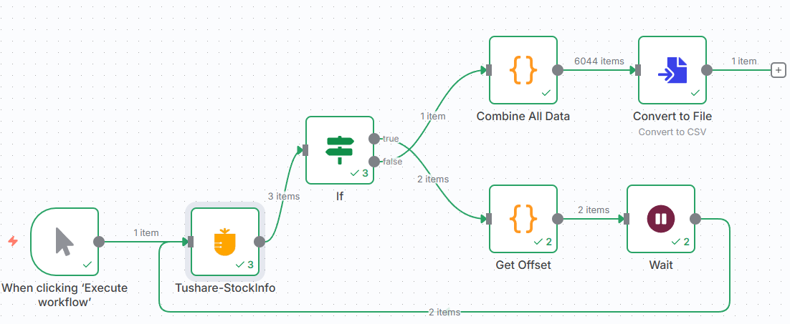

# 工作流使用指南

## Tushare数据分页获取工作流

### 工作流概述

这个工作流专门用于从 Tushare API 获取股票公司数据，具有以下特点：

- **自动分页处理**: 自动处理大量数据的分页获取
- **频率控制**: 内置6秒间隔，避免API调用过于频繁
- **数据合并**: 自动合并所有页面的数据
- **格式转换**: 将数据转换为CSV格式输出



### 工作流结构

```
Manual Trigger → Tushare API → If (检查更多数据) → 
├─ 是 → Get Offset → Wait → Tushare API (循环)
└─ 否 → Combine All Data → Convert to File
```

### 详细节点说明

#### 1. Manual Trigger
- **功能**: 手动触发工作流
- **配置**: 无需特殊配置

#### 2. Tushare-StockInfo
- **功能**: 调用 Tushare API 获取股票公司数据
- **参数**:
  - API Name: `stock_company`
  - Offset: 动态计算的分页偏移量
  - Limit: 3000 (每页数据量)
- **凭据**: 需要配置 Tushare API Token

#### 3. If
- **功能**: 判断是否还有更多数据
- **条件**: `{{ $json.data.has_more }}` 为 true
- **逻辑**: 如果还有更多数据，继续循环；否则结束

#### 4. Get Offset
- **功能**: 计算下一页的偏移量
- **代码逻辑**:
  ```javascript
  const offset = $input.first().json.data.items.length
  return {'offset': offset * ($runIndex+1)};
  ```

#### 5. Wait
- **功能**: 控制API调用频率
- **等待时间**: 6秒
- **目的**: 避免触发API频率限制

#### 6. Combine All Data
- **功能**: 合并所有页面的数据
- **处理逻辑**:
  - 收集所有API调用的结果
  - 提取字段信息
  - 将数据转换为对象数组格式

#### 7. Convert to File
- **功能**: 将数据转换为文件格式
- **输出格式**: CSV
- **配置**: 包含表头

### 使用步骤

1. **导入工作流**
   ```bash
   # 在 n8n 中导入 workflows/page-by-page tushare data fetching.json （或者直接ctrl+c，然后ctrl+v粘贴n8n工作流编辑面板即可）
   ```

2. **配置凭据**
   - 进入 Credentials 页面
   - 添加 Tushare API 凭据
   - 输入你的 API Token

3. **执行工作流**
   - 点击 "Execute Workflow"
   - 等待执行完成
   - 查看输出结果

### 输出结果

工作流执行完成后，你将获得：

- **CSV 文件**: 包含所有股票公司数据的CSV文件
- **数据格式**: 标准化的股票公司信息
- **数据量**: 根据API返回的总数据量而定

### 自定义配置

#### 修改数据量限制
在 Tushare-StockInfo 节点中修改 `limit` 参数：
```json
{
  "limit": 5000  // 修改为所需的数量
}
```

#### 调整等待时间
在 Wait 节点中修改等待时间：
```json
{
  "amount": 10  // 修改为所需的秒数
}
```

#### 添加数据过滤
在 Combine All Data 节点中添加过滤逻辑：
```javascript
// 在数据处理代码中添加过滤条件
const filteredData = final_result.filter(item => 
  item.some_condition === 'desired_value'
);
```

### 故障排除

#### 常见错误及解决方案

1. **API 调用失败**
   - 检查 API Token 是否正确
   - 确认网络连接正常
   - 验证 API 调用频率是否超限

2. **数据获取不完整**
   - 检查 If 节点的条件判断
   - 确认分页逻辑是否正确
   - 验证数据合并逻辑

3. **执行时间过长**
   - 考虑增加 Wait 节点的时间间隔
   - 减少每页的数据量
   - 检查网络连接速度

### 性能优化建议

1. **批量处理**: 适当增加每页数据量，减少API调用次数
2. **缓存机制**: 考虑添加数据缓存，避免重复获取
3. **错误重试**: 添加错误处理和重试机制
4. **监控日志**: 添加执行日志，便于问题排查

### 扩展功能

#### 添加数据验证
```javascript
// 在 Combine All Data 节点中添加数据验证
const validateData = (data) => {
  return data.filter(item => 
    item && item.ts_code && item.name
  );
};
```

#### 添加数据转换
```javascript
// 添加数据格式转换
const transformData = (data) => {
  return data.map(item => ({
    ...item,
    created_at: new Date().toISOString()
  }));
};
```

#### 添加通知功能
- 在 Convert to File 节点后添加 Email 或 Webhook 节点
- 配置执行完成后的通知机制 